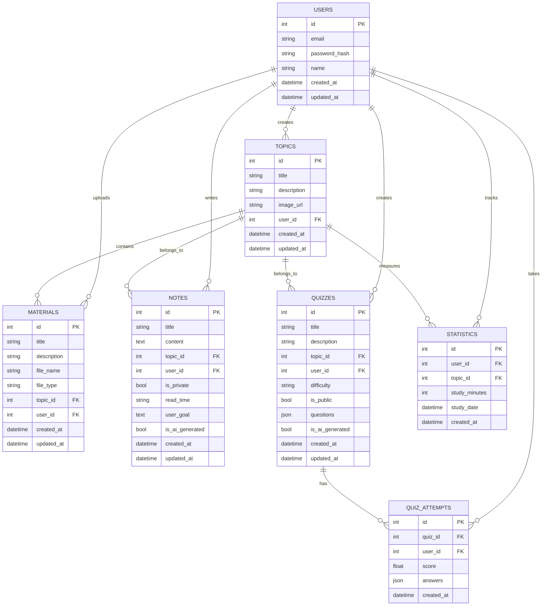

# Database Schema

This document outlines the database schema for the UniHub backend, providing details about tables, relationships, and important fields.

## Overview

UniHub uses a MySQL database with the following schema design principles:
- Normalized structure to minimize redundancy
- Foreign key constraints to maintain data integrity
- Timestamps for auditing and tracking changes
- Soft deletion for important records

## Entity Relationship Diagram



## Tables

### `users`

Stores user account information.

| Column | Type | Description |
|--------|------|-------------|
| `id` | INT | Primary key |
| `email` | VARCHAR(255) | User's email (unique) |
| `password_hash` | VARCHAR(255) | Bcrypt hashed password |
| `name` | VARCHAR(255) | User's full name |
| `created_at` | DATETIME | Record creation timestamp |
| `updated_at` | DATETIME | Record update timestamp |

### `topics`

Represents learning topics created by users.

| Column | Type | Description |
|--------|------|-------------|
| `id` | INT | Primary key |
| `title` | VARCHAR(255) | Topic title |
| `description` | TEXT | Topic description |
| `image_url` | VARCHAR(255) | Optional image for the topic |
| `user_id` | INT | Foreign key to users table |
| `created_at` | DATETIME | Record creation timestamp |
| `updated_at` | DATETIME | Record update timestamp |

Indexes:
- `user_id` (Foreign key)

### `materials`

Stores uploaded learning materials.

| Column | Type | Description |
|--------|------|-------------|
| `id` | INT | Primary key |
| `title` | VARCHAR(255) | Material title |
| `description` | TEXT | Material description |
| `file_name` | VARCHAR(255) | Uploaded file name |
| `file_type` | VARCHAR(50) | File type (pdf, docx, etc.) |
| `topic_id` | INT | Foreign key to topics table |
| `user_id` | INT | Foreign key to users table |
| `created_at` | DATETIME | Record creation timestamp |
| `updated_at` | DATETIME | Record update timestamp |

Indexes:
- `topic_id` (Foreign key)
- `user_id` (Foreign key)

### `notes`

Stores both user-created and AI-generated notes.

| Column | Type | Description |
|--------|------|-------------|
| `id` | INT | Primary key |
| `title` | VARCHAR(255) | Note title |
| `content` | TEXT | Note content in Markdown format |
| `topic_id` | INT | Foreign key to topics table |
| `user_id` | INT | Foreign key to users table |
| `is_private` | BOOLEAN | Whether the note is private |
| `read_time` | VARCHAR(20) | Estimated reading time |
| `user_goal` | TEXT | User's learning goal (for AI notes) |
| `is_ai_generated` | BOOLEAN | Whether note was AI-generated |
| `created_at` | DATETIME | Record creation timestamp |
| `updated_at` | DATETIME | Record update timestamp |

Indexes:
- `topic_id` (Foreign key)
- `user_id` (Foreign key)

### `quizzes`

Stores quizzes with their questions.

| Column | Type | Description |
|--------|------|-------------|
| `id` | INT | Primary key |
| `title` | VARCHAR(255) | Quiz title |
| `description` | TEXT | Quiz description |
| `topic_id` | INT | Foreign key to topics table |
| `user_id` | INT | Foreign key to users table |
| `difficulty` | VARCHAR(20) | Quiz difficulty level |
| `is_public` | BOOLEAN | Whether the quiz is public |
| `questions` | JSON | Array of quiz questions |
| `is_ai_generated` | BOOLEAN | Whether quiz was AI-generated |
| `created_at` | DATETIME | Record creation timestamp |
| `updated_at` | DATETIME | Record update timestamp |

Question JSON structure:
```json
[
  {
    "id": "uuid",
    "question": "Question text",
    "questionType": "multiple_choice",
    "options": ["Option A", "Option B", "Option C", "Option D"],
    "correctAnswer": "Option B"
  }
]
```

Indexes:
- `topic_id` (Foreign key)
- `user_id` (Foreign key)

### `quiz_attempts`

Records user attempts at quizzes.

| Column | Type | Description |
|--------|------|-------------|
| `id` | INT | Primary key |
| `quiz_id` | INT | Foreign key to quizzes table |
| `user_id` | INT | Foreign key to users table |
| `score` | FLOAT | Quiz score percentage |
| `answers` | JSON | User's answers to questions |
| `created_at` | DATETIME | Record creation timestamp |

Answer JSON structure:
```json
[
  {
    "questionId": "uuid",
    "selectedAnswer": "Option B",
    "isCorrect": true
  }
]
```

Indexes:
- `quiz_id` (Foreign key)
- `user_id` (Foreign key)

### `statistics`

Tracks user study statistics.

| Column | Type | Description |
|--------|------|-------------|
| `id` | INT | Primary key |
| `user_id` | INT | Foreign key to users table |
| `topic_id` | INT | Foreign key to topics table |
| `study_minutes` | INT | Minutes spent studying |
| `study_date` | DATE | Date of the study session |
| `created_at` | DATETIME | Record creation timestamp |

Indexes:
- `user_id` (Foreign key)
- `topic_id` (Foreign key)

## SQL Migrations

The database schema is managed through SQL migration files in the `src/migrations/` directory. Key migration files include:

1. `added_basic_tables.sql` - Creates the initial database structure
2. `add_is_public_to_quizzes.sql` - Adds the is_public field to quizzes
3. `add_quiz_attempts_answers.sql` - Adds the answers JSON field to quiz_attempts
4. `update_quizzes_schema.sql` - Updates quizzes table with questions JSON field
5. `fix_quiz_attempts.sql` - Fixes the structure of the quiz_attempts table
6. `fix_quizzes_table.sql` - Adds is_ai_generated field to quizzes table

## Running Migrations

Migrations are applied automatically using the `run_migrations.js` script:

```bash
npm run migrate
```

The migration system:
1. Connects to the database
2. Checks which migrations have already been applied
3. Runs new migrations in alphabetical order
4. Logs the results of each migration

## JSON Fields

The schema uses JSON fields for flexible data storage:

1. `quizzes.questions` - Stores quiz questions, options, and correct answers
2. `quiz_attempts.answers` - Stores user's answers to quiz questions

This approach provides flexibility while maintaining queryability for important fields.

## Relationships

The database enforces referential integrity through foreign key constraints:

- Users create topics, notes, quizzes, and upload materials
- Topics contain materials, notes, and quizzes
- Quizzes have attempts by users
- Statistics track study time per user and topic

These relationships ensure data consistency and enable complex queries across related data. 