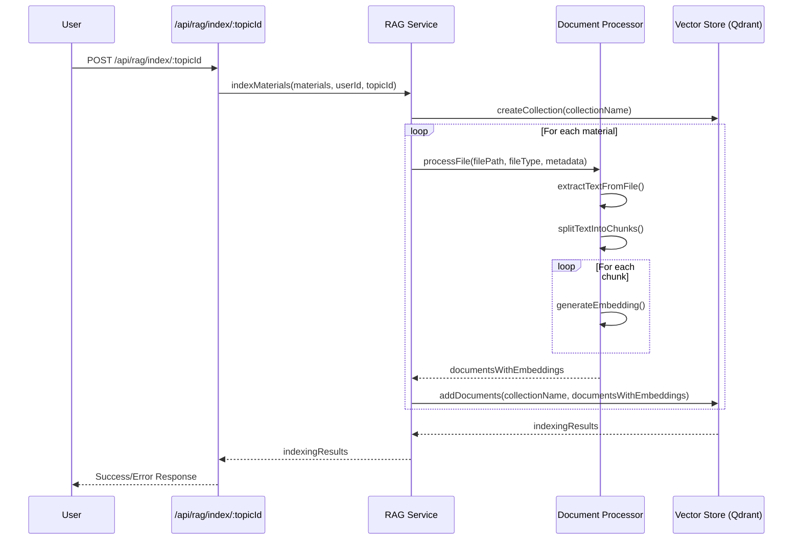
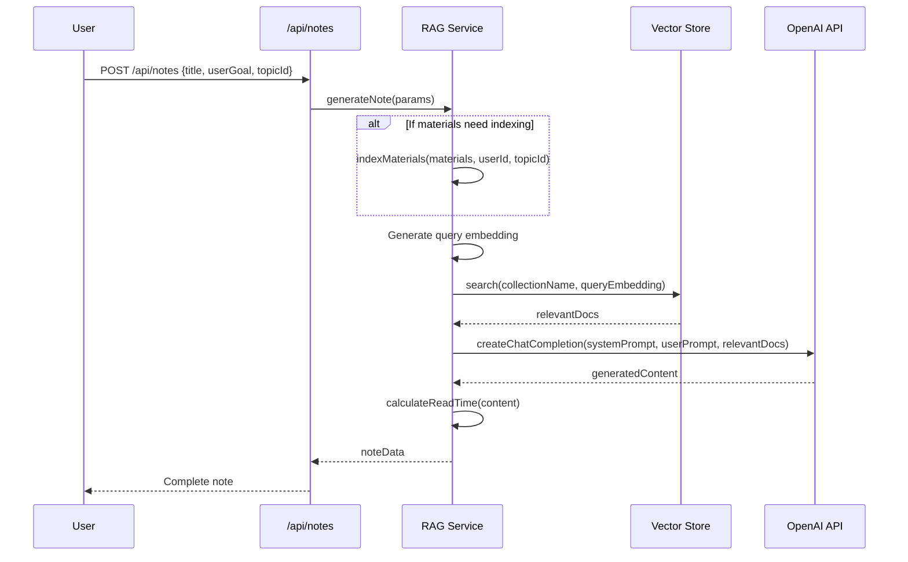
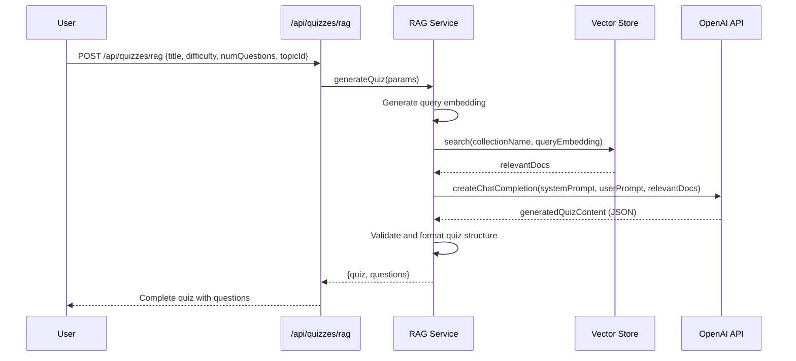

# RAG Architecture in UniHub

This document provides an in-depth explanation of the Retrieval-Augmented Generation (RAG) architecture implemented in the UniHub platform, including its components, workflow, and technical details.

## What is RAG?

Retrieval-Augmented Generation (RAG) is an AI framework that enhances large language models (LLMs) by providing them with additional context retrieved from a knowledge base. In UniHub, RAG enables the system to generate educational content (notes and quizzes) based on students' learning materials.


In the diagram above:
1. User uploads study materials
2. System processes and indexes materials
3. User requests AI-generated content
4. System retrieves relevant context
5. LLM generates content with context
6. Content is returned to the user

## Core Components

The RAG service in UniHub consists of three main components:

### 1. Document Processor (`documentProcessor.js`)

The Document Processor handles:
- **Text Extraction**: Converts various file formats (PDF, DOCX, etc.) to plain text
- **Document Chunking**: Splits long documents into manageable chunks with overlaps
- **Embedding Generation**: Creates vector embeddings for each chunk using OpenAI's embedding API

```js
// Key functions in documentProcessor.js
extractTextFromFile(filePath, fileType) // Extracts text from files
splitTextIntoChunks(text, chunkSize, overlap, metadata) // Splits text into chunks
generateEmbedding(text, retries, timeoutMs) // Generates vector embeddings
processFile(filePath, fileType, metadata, maxChunks) // Full processing pipeline
```

### 2. Vector Store (`vectorStore.js`)

The Vector Store manages:
- **Collection Management**: Creates and maintains Qdrant collections for topics
- **Document Storage**: Stores document chunks with their embeddings
- **Semantic Search**: Finds semantically similar documents based on query embeddings

```js
// Key functions in vectorStore.js
createCollection(collectionName) // Creates a new Qdrant collection
addDocuments(collectionName, documents) // Adds documents to collection
search(collectionName, queryEmbedding, limit, minScore) // Searches for similar documents
deleteCollection(collectionName) // Deletes a collection
```

### 3. Content Generators

#### Note Generator (`noteGenerator.js`)

Handles:
- **Material Indexing**: Processes and indexes learning materials
- **Context Retrieval**: Finds relevant context for a note request
- **Note Generation**: Passes context to OpenAI to generate comprehensive notes
- **Chat Functionality**: Enables contextual chat with learning materials

```js
// Key functions in noteGenerator.js
indexMaterials(materials, userId, topicId) // Indexes materials for a topic
generateNote({title, userGoal, materials, userId, topicId}) // Generates a complete note
chatWithTopic({message, userId, topicId, previousMessages}) // Chat functionality
```

#### Quiz Generator (`quizGenerator.js`)

Handles:
- **Quiz Creation**: Generates quizzes based on learning materials
- **Question Generation**: Creates multiple-choice questions with OpenAI
- **Difficulty Adjustment**: Adapts quiz complexity based on specified level

```js
// Key functions in quizGenerator.js
generateQuiz({title, difficulty, numQuestions, userId, topicId}) // Generates a complete quiz
```

## Technical Implementation Details

### Document Processing

| Stage | Implementation | Notes |
|-------|---------------|-------|
| **Text Extraction** | Uses `pdf-parse` for PDFs<br>Uses `mammoth` for DOCX | Image-based content is referenced but not processed |
| **Chunking Strategy** | Paragraph-based with overlap | Default: 1000 char chunks with 200 char overlap |
| **Embedding Generation** | OpenAI's `text-embedding-ada-002` model | Fallback to mock embeddings when API unavailable |

### Vector Storage

| Feature | Implementation | Notes |
|---------|---------------|-------|
| **Vector Database** | Qdrant Cloud | Free tier supported |
| **Collection Naming** | `user_{userId}_topic_{topicId}` | Separate collection per user/topic |
| **Vector Dimensions** | 1536 | Matches OpenAI embeddings |
| **Similarity Metric** | Cosine similarity | Default threshold: 0.7 |

### Content Generation

| Feature | Implementation | Notes |
|---------|---------------|-------|
| **LLM Provider** | OpenAI | Uses GPT-3.5 Turbo (default) |
| **Prompt Engineering** | System and user prompts | Carefully designed for educational content |
| **Fallback Strategy** | Mock content generation | When API is unavailable |
| **Rate Limiting** | Exponential backoff | Handles API throttling gracefully |

## RAG Workflow

### 1. Material Indexing Workflow



### 2. Note Generation Workflow



### 3. Quiz Generation Workflow



## Database Schema for RAG

The following tables are essential for the RAG functionality:

| Table | Key Fields | Purpose |
|-------|------------|---------|
| `topics` | id, user_id, title | Organizes learning materials |
| `materials` | id, topic_id, file_name, file_type | Stores uploaded materials |
| `notes` | id, topic_id, title, content, user_goal, is_ai_generated | Stores AI-generated notes |
| `quizzes` | id, topic_id, title, description, is_public, is_ai_generated, questions | Stores quizzes |
| `quiz_attempts` | id, quiz_id, user_id, score, answers | Records quiz attempts |

## Performance Optimizations

The RAG implementation includes several optimizations:

1. **Timeout Protection**: All API calls have timeout protection to prevent hanging requests
2. **Batched Processing**: Documents are processed and stored in batches to prevent overloading the system
3. **Exponential Backoff**: Retries with exponential backoff for API rate limiting
4. **Mock Fallbacks**: Graceful fallbacks to mock functionality when external services fail
5. **Collection Reuse**: Avoids recreating collections that already exist
6. **Chunk Limitation**: Limits the number of chunks processed per file to prevent excessive API usage

## Testing

The RAG service can be tested using the `test-rag.js` script, which verifies:

1. Connection to Qdrant
2. Collection creation
3. Document embedding and storage
4. Vector similarity search
5. Collection deletion

```bash
# Run the RAG service test
node test-rag.js
```

## Error Handling

The RAG service includes comprehensive error handling:

- **API Failures**: Graceful fallbacks with mock content generation
- **Timeouts**: All operations have timeout protection
- **Rate Limiting**: Exponential backoff for API rate limits
- **Logging**: Detailed logging with clear error messages

## Future Enhancements

Planned improvements to the RAG system:

1. **Multi-Modal Support**: Processing images with OCR and vision models
2. **Local Embedding Models**: Option to use local models for embeddings
3. **Enhanced Metadata Filtering**: More sophisticated filtering of search results
4. **Adaptive Chunk Sizing**: Dynamic chunk sizing based on content type
5. **Alternative LLM Support**: Integration with additional LLM providers

## Conclusion

The RAG architecture in UniHub provides a powerful foundation for AI-enhanced educational content generation. By combining document processing, vector storage, and large language models, the system can generate contextually relevant notes and quizzes that directly relate to students' learning materials. 